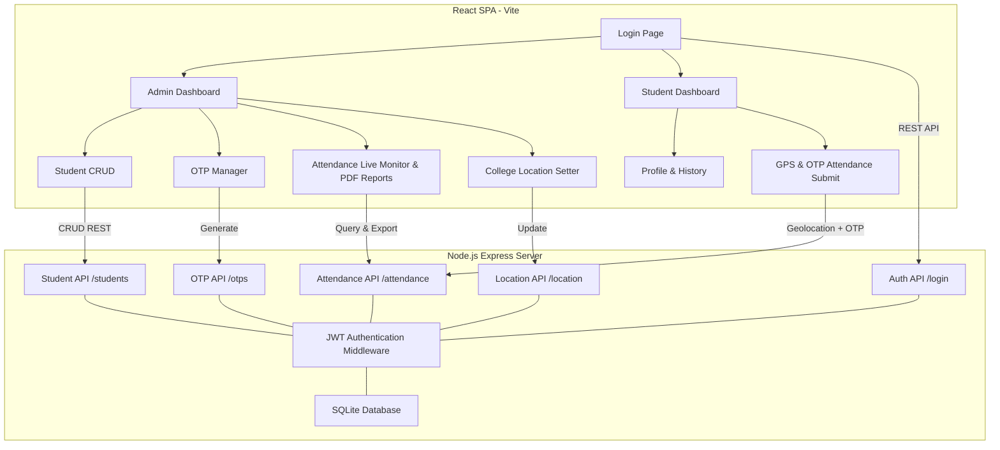

# GPS + OTP Based College Attendance System - Implementation Plan

We will build a secure, real-time GPS and OTP-based College Attendance System. The application consists of a Node.js + Express.js backend (using SQLite for persistence) and a React.js (Vite) frontend featuring a premium, glassmorphic dark-mode user interface.

## User Review Required

> [!IMPORTANT]
> - **Database choice**: SQLite will be used because it requires no manual setup or server installation, making local execution seamless out-of-the-box.
> - **Maps & Location**: Since Google Maps requires a paid API Key which may not be available, we will use **Leaflet.js** (an open-source, free interactive map library) to display the college location radius and student location. The browser's Geolocation API will be used for retrieving live GPS coordinates.
> - **Default Credentials**: The system will automatically seed an Admin account with the credentials `admin@college.edu` / `Admin@123`.

---

## Proposed Changes

We will organize the workspace into two clean directories:
1. `backend/`: Node.js Express server, SQLite database, JWT auth, security, and API endpoints.
2. `frontend/`: Vite React app with premium styling, routing, dashboards, and PDF reporting.

---

### Backend Component

We will create a Node.js + Express backend serving endpoints for authentication, student management, OTP generation/validation, attendance processing, and college location management.

#### [NEW] [backend/package.json](file:///c:/Users/PRIT/OneDrive/Desktop/Attendence/backend/package.json)
Configures scripts and dependencies: `express`, `cors`, `sqlite3` (or `better-sqlite3`), `jsonwebtoken`, `bcryptjs`, `dotenv`.

#### [NEW] [backend/db.js](file:///c:/Users/PRIT/OneDrive/Desktop/Attendence/backend/db.js)
Initializes the SQLite database (`college_attendance.db`) and creates the tables:
- `admin` (id, name, email, password)
- `students` (id, enrollment_no, name, course, semester, mobile, username, password)
- `otp` (id, otp, generated_time, expire_time, generated_by, date)
- `attendance` (id, student_id, otp_id, date, time, latitude, longitude, distance, status)
- `college_location` (id, latitude, longitude, radius)

It will automatically seed a default admin account and a default college location.

#### [NEW] [backend/server.js](file:///c:/Users/PRIT/OneDrive/Desktop/Attendence/backend/server.js)
Main entry point. Set up routes, database connections, static file serving (for production), and start the server.

#### [NEW] [backend/routes/auth.js](file:///c:/Users/PRIT/OneDrive/Desktop/Attendence/backend/routes/auth.js)
Endpoints for Admin & Student Login, using bcrypt for password validation and issuing JWT tokens.

#### [NEW] [backend/routes/students.js](file:///c:/Users/PRIT/OneDrive/Desktop/Attendence/backend/routes/students.js)
CRUD endpoints for Student Management. When creating a student, handles generation of secure usernames and passwords.

#### [NEW] [backend/routes/otp.js](file:///c:/Users/PRIT/OneDrive/Desktop/Attendence/backend/routes/otp.js)
Handles OTP generation:
- Limit to maximum 5 OTPs per day.
- Generates a 6-digit random code.
- Stores `generated_time` and `expire_time` (2 minutes).

#### [NEW] [backend/routes/attendance.js](file:///c:/Users/PRIT/OneDrive/Desktop/Attendence/backend/routes/attendance.js)
Processes attendance submissions and reports:
- Validates the provided OTP (checks match and ensures not expired).
- Validates uniqueness (checks if this student already marked attendance for this OTP).
- Computes student-to-college distance using the Haversine formula.
- If distance $\le$ college radius (200m), records status as 'Success'/'Present'. Otherwise records as 'Failed'/'Rejected'.
- Endpoints for exporting daily/monthly logs.

---

### Frontend Component

We will create a React.js single-page application inside the `frontend` directory using Vite. It will feature custom, high-end CSS styling with responsive layouts, animations, and an interactive Leaflet map.

#### [NEW] [frontend/package.json](file:///c:/Users/PRIT/OneDrive/Desktop/Attendence/frontend/package.json)
Configures Vite React app and dependencies: `lucide-react` (icons), `jspdf` and `jspdf-autotable` (PDF export).

#### [NEW] [frontend/src/index.css](file:///c:/Users/PRIT/OneDrive/Desktop/Attendence/frontend/src/index.css)
Declares the CSS design system: HSL variables for dark glassmorphism gradients, glow animations, card styles, and premium scrollbars.

#### [NEW] [frontend/src/App.jsx](file:///c:/Users/PRIT/OneDrive/Desktop/Attendence/frontend/src/App.jsx)
Main router and layout control, matching auth state to route (Admin Dashboard, Student Dashboard, Login).

#### [NEW] [frontend/src/components/Login.jsx](file:///c:/Users/PRIT/OneDrive/Desktop/Attendence/frontend/src/components/Login.jsx)
Login screen with credentials validator, custom card glassmorphism effect, and dynamic validation messages.

#### [NEW] [frontend/src/components/AdminDashboard.jsx](file:///c:/Users/PRIT/OneDrive/Desktop/Attendence/frontend/src/components/AdminDashboard.jsx)
Admin layout containing:
- **Stats Widgets**: Row of widgets showing Total Students, Present Today, Absent Today, OTP Remaining.
- **Student Manager**: Searchable student list with Add/Edit/Delete actions.
- **OTP Manager**: Generation button (max 5/day limit verification) and live active OTP timer countdown.
- **Attendance Live Monitor**: Live table updating when students register attendance.
- **College Location Configurator**: Latitude/Longitude inputs and a Leaflet-based map integration.
- **Reports & PDF Exporter**: Dropdown filters (Today, Yesterday, Monthly, Student-wise) and PDF download button.

#### [NEW] [frontend/src/components/StudentDashboard.jsx](file:///c:/Users/PRIT/OneDrive/Desktop/Attendence/frontend/src/components/StudentDashboard.jsx)
Student layout containing:
- **Attendance Card**: OTP input field, "Get My Location" button, and submit action.
- **Live Details Grid**: Displays current Lat/Lon coordinates, calculated distance to college, and active status.
- **Profile Info & History**: Display of student records and personal attendance history.

---

## Verification Plan

### Automated Verification
We will verify API endpoints and business logic by:
1. Writing a test suite script `backend/test_api.js` to simulate database insertions, JWT login, OTP creation, distance calculation validations, and daily count limits.
2. Running local builds of Vite client to ensure the build compiles successfully without bundling errors.

### Manual Verification
1. Open the browser and test both user roles:
   - Login as Admin, configure college location, and generate an OTP.
   - Login as Student, input the OTP, grant Geolocation permission, and submit attendance.
   - Verify distance validation behavior (simulate coordinates inside and outside the 200m radius).
   - Check PDF reports downloads and database persistence.
